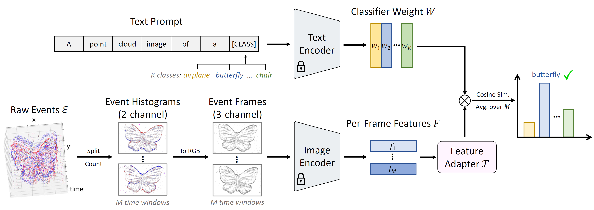

# EventCLIP

[**EventCLIP: Adapting CLIP for Event-based Object Recognition**](https://github.com/Wuziyi616/EventCLIP)<br/>
[Ziyi Wu](https://wuziyi616.github.io/),
[Xudong Liu](https://www.linkedin.com/in/xudong-frank-liu-566513198/),
[Igor Gilitschenski](https://tisl.cs.utoronto.ca/author/igor-gilitschenski/)<br/>
_[arXiv'23](https://arxiv.org/abs/2306.06354) |
[GitHub](https://github.com/Wuziyi616/EventCLIP) |
[arXiv](https://arxiv.org/abs/2306.06354)_

## Introduction

This is the official PyTorch implementation for paper: [EventCLIP: Adapting CLIP for Event-based Object Recognition](https://arxiv.org/abs/2306.06354).
The code contains:

-   Zero-shot EventCLIP inference on N-Caltech, N-Cars, N-ImageNet datasets
-   Few-shot adaptation of EventCLIP on the three datasets, with SOTA results in the low-data regime
-   Data-efficient fine-tuning of EventCLIP on N-ImageNet, achieving superior accuracy over fully-trained baselines

### Motivation

[Event cameras](https://tub-rip.github.io/eventvision2023/#null) are bio-inspired low-latency and energy-efficient sensors, which have gained significant interest recently.
However, due to the lack of large-scale datasets, the event-based vision community cannot enjoy the recent success of foundation models in RGB vision.
This paper thus seeks to adapt one of the most impactful VLM, [CLIP](https://openai.com/research/clip), to recognize event data.
We study common practice in data-efficient model adaptation, and propose a general framework named EventCLIP.
The overall pipeline is shown below:

<p align="center"></p>

## Update

-   2023.9.14: Release code for learning with unlabeled data
-   2023.7.17: Release fine-tuning code
-   2023.5.17: Initial code release!

## Installation

Please refer to [install.md](docs/install.md) for step-by-step guidance on how to install the packages.

## Experiments

**This codebase is tailored to [Slurm](https://slurm.schedmd.com/documentation.html) GPU clusters with preemption mechanism.**
For the configs, we mainly use A40 with 40GB memory (though many experiments don't require so much memory).
Please modify the code accordingly if you are using other hardware settings:

-   Please go through `train.py` and change the fields marked by `TODO:`
-   Please read the config file for the model you want to train.
    We use DDP with multiple GPUs to accelerate training.
    You can use less GPUs to achieve a better memory-speed trade-off

### Dataset Preparation

Please refer to [data.md](docs/data.md) for dataset downloading and pre-processing.

### Reproduce Results

Please see [benchmark.md](docs/benchmark.md) for detailed instructions on how to reproduce our results in the paper.

## Possible Issues

See the troubleshooting section of [nerv](https://github.com/Wuziyi616/nerv#possible-issues) for potential issues.

Please open an issue if you encounter any errors running the code.

## Citation

Please cite our paper if you find it useful in your research:

```
@article{wu2023eventclip,
  title={{EventCLIP}: Adapting CLIP for Event-based Object Recognition},
  author={Wu, Ziyi and Liu, Xudong and Gilitschenski, Igor},
  journal={arXiv preprint arXiv:2306.06354},
  year={2023}
}
```

## Acknowledgement

We thank the authors of [CLIP](https://github.com/openai/CLIP), [EST](https://github.com/uzh-rpg/rpg_event_representation_learning), [n_imagenet](https://github.com/82magnolia/n_imagenet), [PointCLIP](https://github.com/ZrrSkywalker/PointCLIP), [LoRA](https://github.com/microsoft/LoRA) for opening source their wonderful works.

## License

EventCLIP is released under the MIT License. See the LICENSE file for more details.

## Contact

If you have any questions about the code, please contact Ziyi Wu dazitu616@gmail.com
